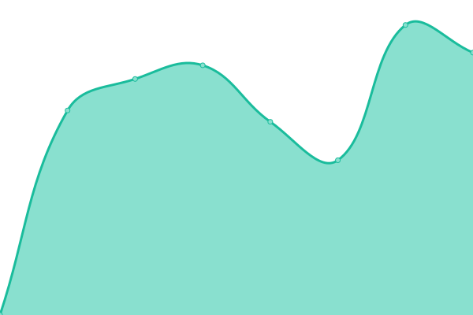
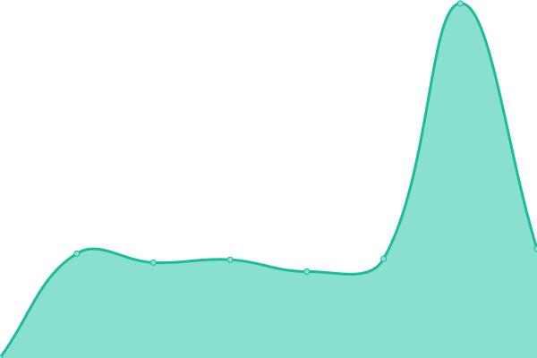
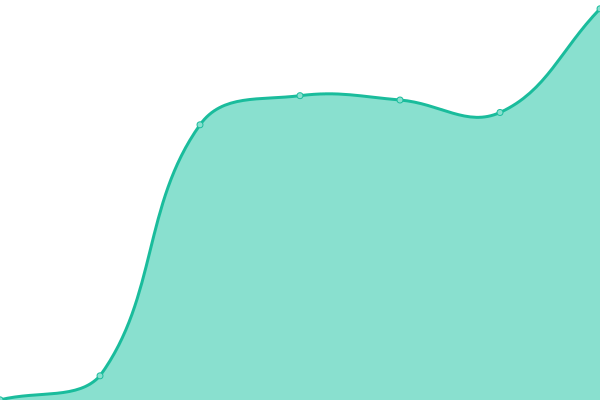
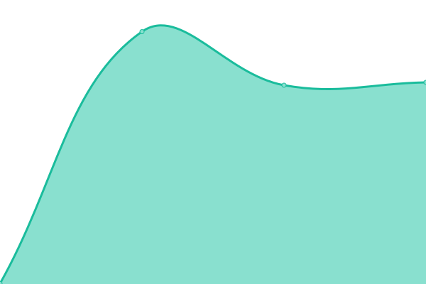

# [📈 Live Status](https://zeroboard-dev.github.io/status-page): <!--live status--> **🟧 Partial outage**

This repository contains the open-source uptime monitor and status page for [Dataseed](https://dataseed.zeroboard.jp/), powered by [Upptime](https://github.com/upptime/upptime).

With [Upptime](https://upptime.js.org), you can get your own unlimited and free uptime monitor and status page, powered entirely by a GitHub repository. We use [Issues](https://github.com/zeroboard-dev/status-page/issues) as incident reports, [Actions](https://github.com/zeroboard-dev/status-page/actions) as uptime monitors, and [Pages](https://zeroboard-dev.github.io/status-page) for the status page.

<!--start: status pages-->
<!-- This summary is generated by Upptime (https://github.com/upptime/upptime) -->
<!-- Do not edit this manually, your changes will be overwritten -->
<!-- prettier-ignore -->
| URL | Status | History | Response Time | Uptime |
| --- | ------ | ------- | ------------- | ------ |
|  [Production Frontend](https://dataseed.zeroboard.jp) | 🟩 Up | [production-frontend.yml](https://github.com/zeroboard-dev/status-page/commits/HEAD/history/production-frontend.yml) | 

 1907ms
     
 | 

<a href="https://zeroboard-dev.github.io/status-page/history/production-frontend">100.00%</a>
    

|  [Production API](https://prod-api.dataseed.zeroboard.jp/health) | 🟩 Up | [production-api.yml](https://github.com/zeroboard-dev/status-page/commits/HEAD/history/production-api.yml) | 

 502ms
     
 | 

<a href="https://zeroboard-dev.github.io/status-page/history/production-api">100.00%</a>
    

|  [Staging Frontend](https://stg.dataseed.zeroboard-dev.jp) | 🟥 Down | [staging-frontend.yml](https://github.com/zeroboard-dev/status-page/commits/HEAD/history/staging-frontend.yml) | 

 1412ms
     
 | 

<a href="https://zeroboard-dev.github.io/status-page/history/staging-frontend">98.83%</a>
    

|  [Staging API](https://stg-api.dataseed.zeroboard-dev.jp/health) | 🟩 Up | [staging-api.yml](https://github.com/zeroboard-dev/status-page/commits/HEAD/history/staging-api.yml) | 

 536ms
     
 | 

<a href="https://zeroboard-dev.github.io/status-page/history/staging-api">100.00%</a>
    

|  [Dev Frontend](https://dev.dataseed.zeroboard-dev.jp) | 🟩 Up | [dev-frontend.yml](https://github.com/zeroboard-dev/status-page/commits/HEAD/history/dev-frontend.yml) | 

 1122ms
     
 | 

<a href="https://zeroboard-dev.github.io/status-page/history/dev-frontend">98.83%</a>
    

|  [Dev API](https://dev-api.dataseed.zeroboard-dev.jp/health) | 🟩 Up | [dev-api.yml](https://github.com/zeroboard-dev/status-page/commits/HEAD/history/dev-api.yml) | 

 474ms
     
 | 

<a href="https://zeroboard-dev.github.io/status-page/history/dev-api">1.01%</a>
    

<!--end: status pages-->

[**Visit our status website →**](https://zeroboard-dev.github.io/status-page)

## 📄 License

- Powered by: [Upptime](https://github.com/upptime/upptime)
- Code: [MIT](./LICENSE) © [Dataseed](https://dataseed.zeroboard.jp/)
- Data in the `./history` directory: [Open Database License](https://opendatacommons.org/licenses/odbl/1-0/)
